# splunk-gns3

## Instalación de Splunk y recogida de logs de máquinas Mikrotik, Ubuntu, Vyos, CentOS en Splunk creadas mediante GNS3.

Vamos a realizar un ejercicio donde instalaremos splunk en una máquina virtual Debian, el programa que utilizaremos para virtualizar dicha máquina será VMWare.


### Instalación de Splunk

Tenemos un Debian 10 actualizado y virtualizado en VMWare, para instalar Splunk es bastante sencillo, nos iremos a la [página de descargas de Splunk](https://www.splunk.com/en_us/download/splunk-enterprise.html).
En este caso elegiremos la versión gratuita de Enterprise.

Nos descargaremos la versión de Linux .deb, ya que estamos usando una máquina Debian.

Al tenerlo descargado simplemente para instalarlo ejecutamos como superusuario:
```
dpkg -i splunk-8.0.6-152fb4b2bb96-linux-2.6-amd64.deb
```

Una vez termine, la instalación será realizada en /opt/splunk de nuestra máquina.

Para encender splunk y tener nuestra aplicación web simplemente realizamos el siguiente comando:

```
/opt/splunk/bin/splunk start
```

Se nos pedirá aceptar la licencia y crear un usuario administrador para poder operar con splunk, una vez hecho ya podremos acceder a la web mediante el puerto 8000.

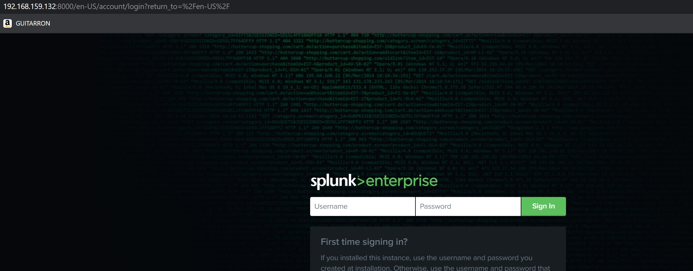


### Instalación de GNS3

GNS3 es una aplicación que nos permite jugar con escenarios complejos de redes, en este caso lo vamos a utilizar para virtualizar las máquinas Mikrotik, Ubuntu, Vyos y CentOS pedidas en el ejercicio.

Para instalarlo simplemente nos vamos a la [página de descargas de GNS3](https://www.gns3.com/software/download), en mi caso instalé la de Windows que es la máquina donde tengo la máquina virtual de Splunk instalada.

Muy importante escoger la opción de GNS3 VM y ponerla en VMWare que es donde mejor funciona la virtualización.

Una vez instalado tendremos esta ventana:


Crearemos un nuevo proyecto en la pestaña File -> New Blank Project y elegimos el nombre que queramos para el proyecto.

Para la instalación de las máquinas, primero debemos darle a File -> New Templates -> Install an appliance from the GNS3 server.

Escogeremos la imagen que queramos, en este caso nos descargaremos las de Cisco, Mikrotik, Vyos y Ubuntu, y nos quedaría así:

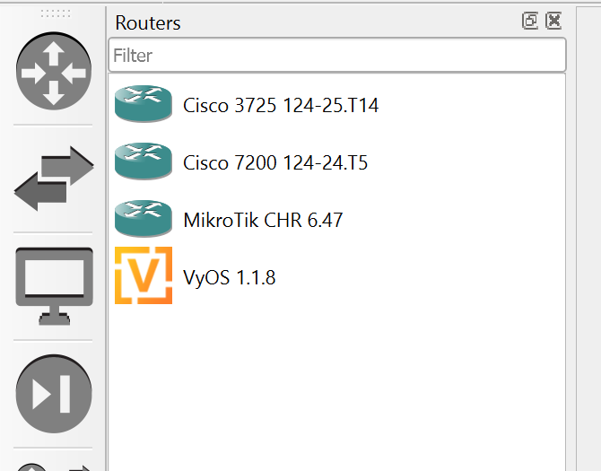
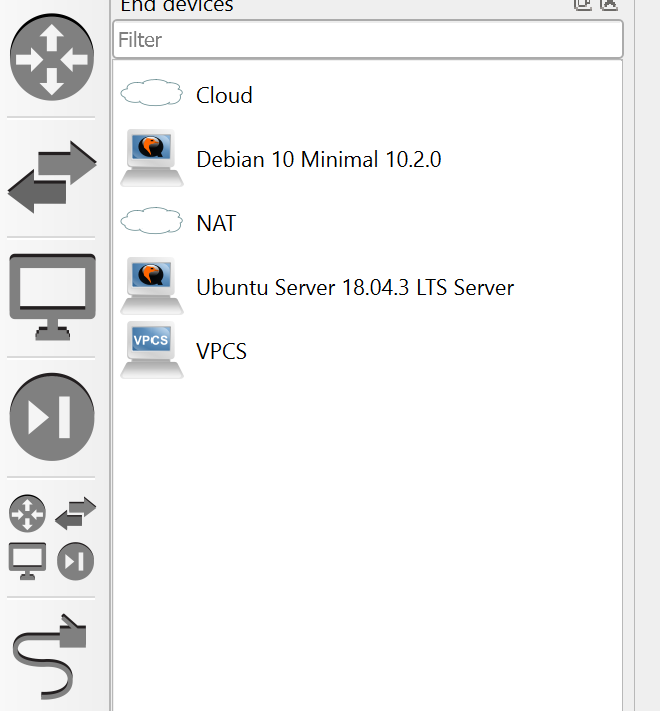


#### Creación de Interfaz Loopback

Para conectar todas las máquinas en una red y que pueda acceder a nuestro servidor de Syslog, debemos crear una interfaz loopback en nuestro ordenador, para ello daremos a la tecla Windows+R y escribiremos hdwwiz

En dicha pestaña elegiremos la opción de Buscar e instalar software automáticamente -> Adaptadores de Red -> Microsoft -> Adaptador de bucle invertido KV-TEST de Microsoft.

Una vez tengamos la red nos saldrá en nuestros adaptadores de redes:


Ahora simplemente debemos compartir nuestra red con dicha interfaz, para ello damos click derecho a nuestra interfaz de red internet/ethernet -> Propiedades -> Uso Compartido y elegimos nuestra interfaz Loopback

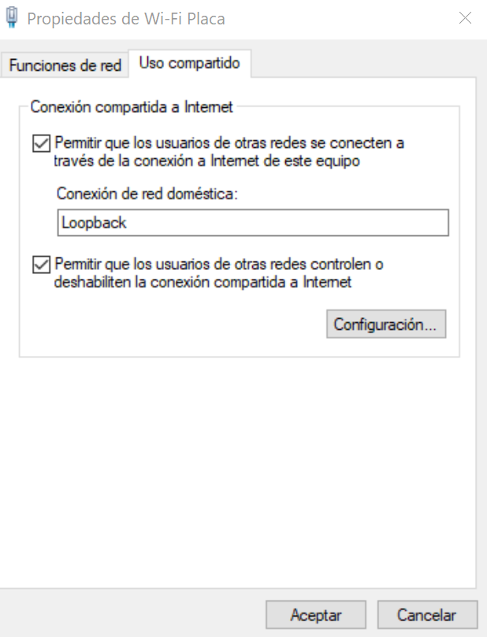

#### Creación de Red Loopback en GNS3

Para crear una red que se conecte a nuestro Loopback, simplemente vamos a Browse End Devices -> Cloud y lo arrastramos al escenario.

Le damos a click derecho -> Configure -> Show special Ethernet interfaces y elegimos nuestra interfaz loopback y le damos a add, si queremos podemos eliminar las otras que ya están.

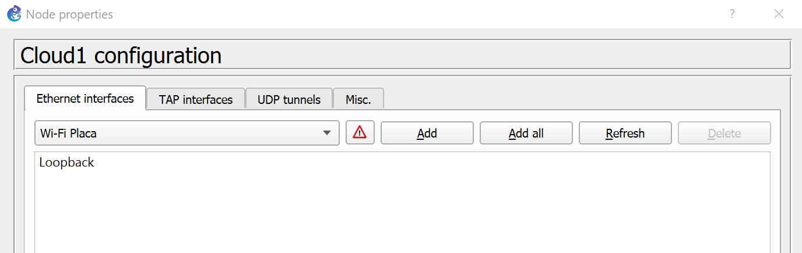

Simplemente tendremos que conectar las máquinas a cada Cloud y ya las tendremos para configurar en la misma red.

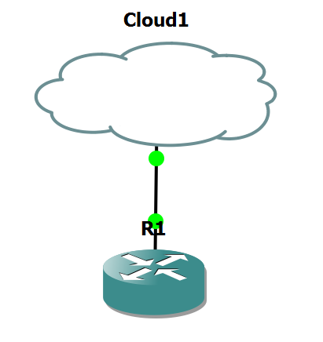


### Instalación y configuración de Kiwi Syslog

Ahora vamos a instalar un servidor de syslog que recoja los datos de GNS3 para enviarlos posteriormente a Splunk, para ello nos vamos a la [página de descarga de Kiwi Syslog](https://www.kiwisyslog.com/free-tools/kiwi-free-syslog-server).

Una vez descargado tendremos esta pestaña.

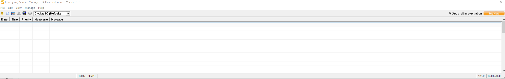

Automáticamente ya viene configurado para que recoga los syslog de las máquinas que se envien por el puerto 514, lo único que vamos a hacer es configurar el envio de esos logs hacia nuestro servidor splunk, para ello vamos a File -> Setup -> Add Rule

Y ponemos esta acción, que hará que envie hacia la IP de nuestro servidor Splunk mediante el puerto UDP 2055 los syslogs recogidos en Kiwi.

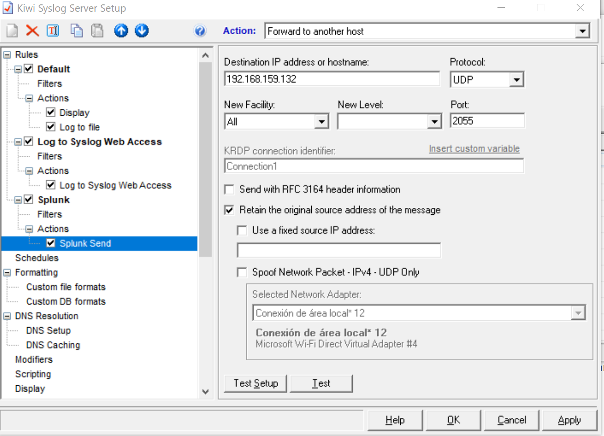


#### Configuración de Syslog-ng en la máquina Splunk

Ahora instalaremos un programa llamado Syslog-ng para recoger los datos de Kiwi Syslog y enviarlos a un fichero de logs

Para instalarlo simplemente ejecutamos el siguiente comando:

```
apt install syslog-ng
```

Vamos ahora a configurar nuestro syslog-ng para que recoga los logs, para ello vamos a /etc/syslog-ng/syslog-ng.conf y ponemos las siguientes líneas:
```

@version: 3.5
@include "scl.conf"
@include "`scl-root`/system/tty10.conf"
    options {
        time-reap(30);
        mark-freq(10);
        keep-hostname(yes);
        };
    source s_local { system(); internal(); };
    source s_network {
        syslog(transport(udp) port(2055));
        };
    filter f_mikrotik { host( "192.168.159.1" ); };
    log { source ( s_network ); filter( f_mikrotik ); destination ( df_mikrotik ); };
    destination df_mikrotik {
    file("/var/log/syslog-ng/${HOST}.${YEAR}.${MONTH}.${DAY}.log"
    template-escape(no)); };

```

Esto hará que todos los logs que se reciban mediante la Ip 192.168.159.1 se envien a la carpeta /var/log/syslog-ng (creada a mano) y se guarde en un archivo que contendrá el dia, el año y el mes de dichos logs.
```
root@splunk:/var/log/syslog-ng# ls
192.168.159.1.2020.09.30.log  logs.txt

root@splunk:/var/log/syslog-ng# cat 192.168.159.1.2020.09.30.log
...
...
Sep 30 12:53:51 192.168.159.1 Original Address=192.168.137.5 Sep 30 10:53:51 vyos ntpd_intres[2217]: host name not found: 1.pool.ntp.org
Sep 30 12:53:51 192.168.159.1 Original Address=192.168.137.5 Sep 30 10:53:51 vyos ntpd_intres[2217]: host name not found: 2.pool.ntp.org
```

Reiniciamos el servicio para que todo funcione correctamente y procederemos a configurar cada una de las máquinas.
```
systemctl restart syslog-ng
```

### Configuración de las máquinas en GNS3

Vamos ahora a configurar las 4 máquinas, para ello tendremos que darles una IP en el rango de nuestra interfaz loopback (192.168.137.0/24) con su gateway en 192.168.137.1 y hacer logging a nuestro servidor de kiwi, en este caso 192.168.137.1

#### Máquina CentOS

Entramos a la máquina CentOS mediante la consola, tendremos que añadirle una IP, para ello ejecutamos los siguientes comandos:

```

R1#conf t
Enter configuration commands, one per line.  End with CNTL/Z.
R1(config)#interface fa0/0
R1(config-if)#
R1(config-if)#ip add 192.168.137.2 255.255.255.0
R1(config-if)#no shutdown
*Mar  1 00:17:21.247: %LINK-3-UPDOWN: Interface FastEthernet0/0, changed state to up
*Mar  1 00:17:22.247: %LINEPROTO-5-UPDOWN: Line protocol on Interface FastEthernet0/0, changed state to up
R1#
*Mar  1 00:17:24.899: %SYS-5-CONFIG_I: Configured from console by console
```

Y hacemos logging a nuestro servidor de Kiwi
```

R1#conf t
Enter configuration commands, one per line.  End with CNTL/Z.
R1(config)#logging host 192.168.137.1
R1(config)#logging trap 6
R1(config)#exit
R1#
*Mar  1 00:18:19.283: %SYS-5-CONFIG_I: Configured from console by console
R1#
*Mar  1 00:18:20.287: %SYS-6-LOGGINGHOST_STARTSTOP: Logging to host 192.168.137.1 port 514 started - CLI initiated
```

Y podemos ver como salen los logs en nuestro kiwi.

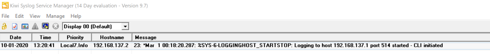


#### Máquina Mikrotik

Ahora entramos en la máquina Mikrotik mediante la consola y haremos lo mismo que con la máquina CentOS.

(En este caso ya lo tendremos configurado pero pondré todos los pasos)
```
[admin@MikroTik] > ip address
[admin@MikroTik] /ip address> add address=192.168.137.3/24 interface=ether1
failure: already have such address
[admin@MikroTik] /ip address> print
Flags: X - disabled, I - invalid, D - dynamic
 #   ADDRESS            NETWORK         INTERFACE
 0   192.168.137.3/24   192.168.137.0   ether1

[admin@MikroTik] > ip route
[admin@MikroTik] /ip route> add gateway=192.168.137.1
[admin@MikroTik] /ip route> print
Flags: X - disabled, A - active, D - dynamic, C - connect, S - static, r - rip, b - bgp, o - ospf, m - mme, B - blackhole, U - unreachable, P - prohibit
 #      DST-ADDRESS        PREF-SRC        GATEWAY            DISTANCE
 0 A S  0.0.0.0/0                          192.168.137.1             1
 1   S  0.0.0.0/0                          192.168.137.1             1
 2 ADC  192.168.137.0/24   192.168.137.3   ether1                    0
```

Ahora nos conectaremos al servidor de syslog mediante los siguientes comandos:
```

[admin@MikroTik] > /system logging action
[admin@MikroTik] /system logging action> set 3 remote=192.168.137.1
[admin@MikroTik] /system logging action> add name=ZLogServer remote=192.168.137.1 target=remote
failure: action already exists with such a name
[admin@MikroTik] /system logging action> /system logging
[admin@MikroTik] /system logging> add action=ZLogServer topics=pppoe,ppp,info
[admin@MikroTik] /system logging> add action=ZLogServer topics=system,info
```

Y en Kiwi podremos observar como se envian los logs

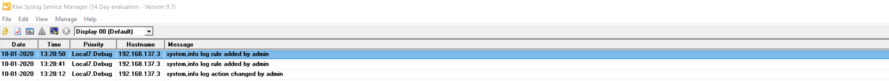


#### Máquina Vyos

Ahora entramos a la máquina Vyos mediante la consola, y hacemos lo que hemos hecho anteriormente con las demás máquinas.
```

root@vyos:~# ip a add 192.168.137.4/24 dev eth0
root@vyos:~# ip l set eth0 up
root@vyos:~# ip a
1: lo: <LOOPBACK,UP,LOWER_UP> mtu 65536 qdisc noqueue state UNKNOWN group default
    link/loopback 00:00:00:00:00:00 brd 00:00:00:00:00:00
    inet 127.0.0.1/8 scope host lo
       valid_lft forever preferred_lft forever
    inet6 ::1/128 scope host
       valid_lft forever preferred_lft forever
2: eth0: <BROADCAST,MULTICAST,UP,LOWER_UP> mtu 1500 qdisc pfifo_fast state UP group default qlen 1000
    link/ether 0c:cd:c2:d5:da:00 brd ff:ff:ff:ff:ff:ff
    inet 192.168.137.4/24 scope global eth0
       valid_lft forever preferred_lft forever
    inet6 fe80::ecd:c2ff:fed5:da00/64 scope link
       valid_lft forever preferred_lft forever
3: eth1: <NO-CARRIER,BROADCAST,MULTICAST,UP> mtu 1500 qdisc pfifo_fast state DOWN group default qlen 1000
    link/ether 0c:cd:c2:d5:da:01 brd ff:ff:ff:ff:ff:ff
4: eth2: <NO-CARRIER,BROADCAST,MULTICAST,UP> mtu 1500 qdisc pfifo_fast state DOWN group default qlen 1000
    link/ether 0c:cd:c2:d5:da:02 brd ff:ff:ff:ff:ff:ff
```

Y ahora solo debemos conectarnos al servidor de syslog
```

vyos@vyos:~$ configure
[edit]
vyos@vyos# set system syslog host 192.168.137.1 facility all level info
[edit]
vyos@vyos# set system syslog host 192.168.137.1 facility mark level info
[edit]
vyos@vyos# save
Warning: you have uncommitted changes that will not be saved.

Saving configuration to '/config/config.boot'...
Done
[edit]
vyos@vyos# commit
[ system syslog ]
Stopping enhanced syslogd: rsyslogd.
Starting enhanced syslogd: rsyslogd.

[edit]

```

Podemos observar como Kiwi recoge los logs de la máquina vyos

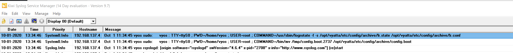


#### Máquina Ubuntu

Haremos lo mismo que con todas las anteriores máquinas, le pondremos un rango de IP al de loopback y nos conectaremos mediante rsyslog a nuestro kiwi syslog.

```
root@gns3:~# ip a add 192.168.137.5/24 dev ens3
root@gns3:~# ip l set ens3 up
```

Ahora simplemente configuramos el fichero /etc/rsyslog.d/50-default.conf y al final del todo ponemos esta línea:
```
*.* @192.168.137.1:514
```

Y reiniciamos el servicio:
```
systemctl restart rsyslog
```

Observamos como se envian los logs a nuestro servidor Kiwi

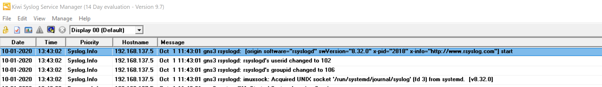